# Logging into Course Account

## Installing VS Code
1. Download VS Code from [here](https://code.visualstudio.com/).
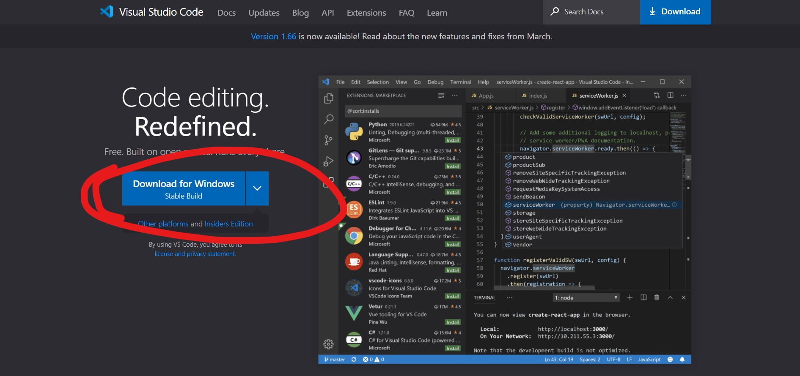
2. After going through the installation process, open VS Code. You should see this:
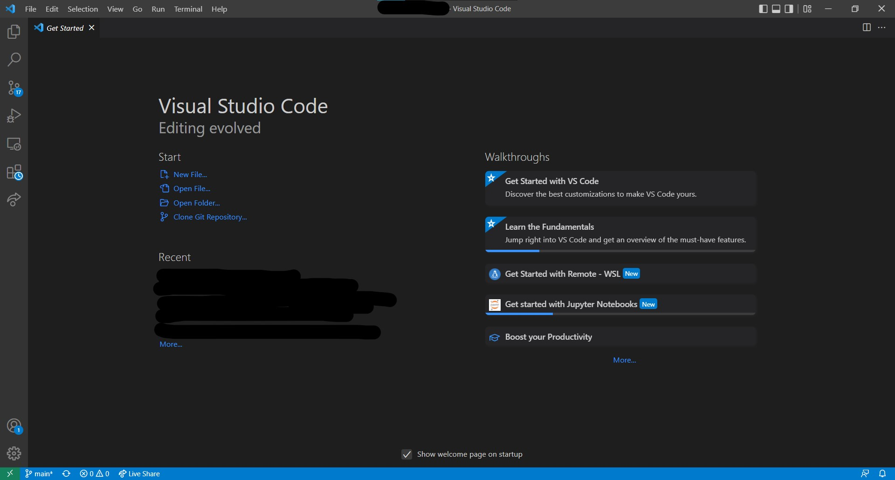

## Remotely Connecting
1. If you are using a Windows OS, then [install OpenSSH](https://docs.microsoft.com/en-us/windows-server/administration/openssh/openssh_install_firstuse)
2. Open your terminal (Command Prompt for Windows users)
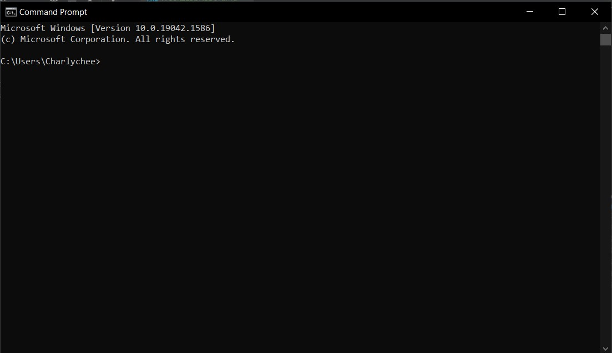
3. Enter in the command `ssh $(YOUR_ACCOUNT)@ieng6.ucsd.edu`
   1. e.g. `ssh cs15lacz@ieng6.ucsd.edu`

   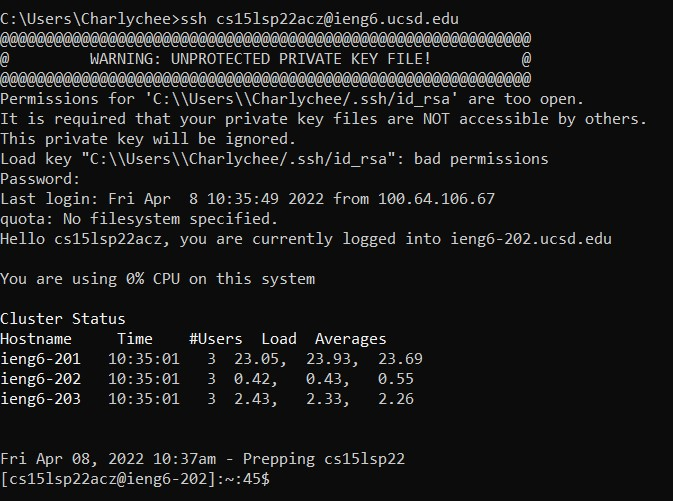

## Trying Some Commands
1. You can now type commands into the terminal and press enter to run them
2. Here's a list of commands you can use:
   1. Change directory to home `cd ~`
   2. Change directory to given directory `cd $DIRECTORY`
   3. Show contents of current directory, listing all files and properties and ordering them by time `ls -lat`
   4. Show contents of current directory, showing all files `ls -a`
   5. Show contents of given directory `ls $DIRECTORY`
   6. Copy a source file to a destination `cp $SOURCE_PATH $DESTINATION_PATH`
   7. Display the contents of given file `cat $FILE_NAME`
   
Here's an example command run
   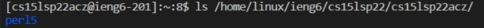
`
## Moving Files with SCP
1. SCP allows users to move files from one system to another. We will practice moving a file from our local computer to the remote server.
2. If you have been following this tutorial from top to bottom, then use the `exit` command to leave the remote server and return to your local computer on the terminal.

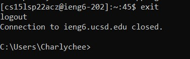
4. Create a file in your current directory
   1. I will be using `WhereAmI.java` for this example

   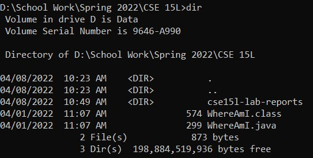
5. To copy this file onto the remote server, enter this command `scp $FILE_NAME $(SERVER_URL):$(SERVER_PATH`
   1. e.g. `scp WhereAmI.java cs15lsp22acz@ieng6.ucsd.edu:~/`

   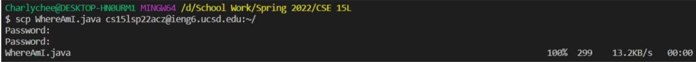
6. Now you can log into the remote server and see your file there.
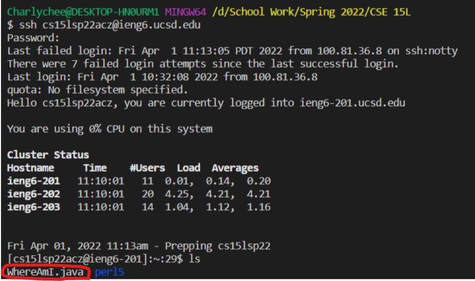

## Setting SSH Key
1. If you have been following this tutorial from top to bottom, then use the `exit` command to leave the remote server and return to your local computer on the terminal.
2. Enter this command to create the SSH Key `ssh-keygen`
3. Enter the directory and file name you would like to save your ssh key
4. Do not add a passphrase
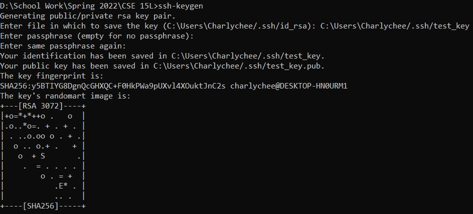
5. SSH onto the remote server and create a .ssh directory on your home directory
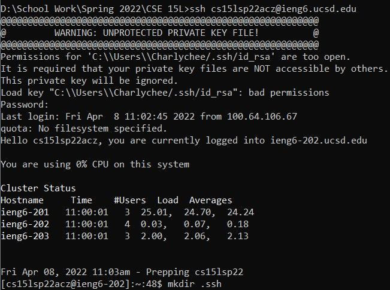
6. Return to your local computer and scp the PUBLIC ssh key to your remote server's .ssh directory

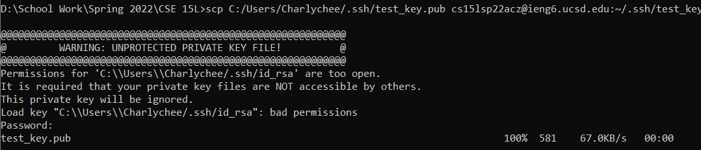

## Optimize Remote Running
1. Multiple commands on the terminal can be run on one line using the semicolon (;)
   1. e.g. 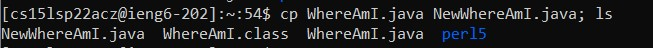
2. We can also run commands on a remote server from our local computer by providing a command after the ssh command.
   1. e.g. 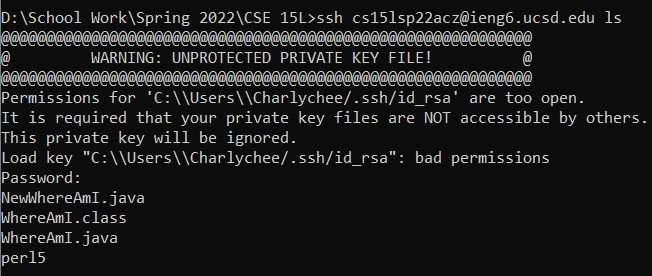
3. Combining these 2 ideas, we can copy a Java program from our local computer to the remote server and compile and run that Java program.

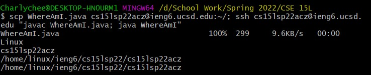