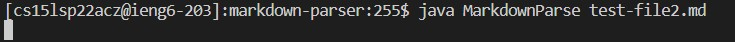

# Lab Report 2

## Code Change 1

[The test file for a failure-inducing input that prompted me to make that change
](https://github.com/Charlychee/markdown-parser/blob/main/test-file3.md)

> The symptom that we see here is that there is a `StringIndexOutOfBoundsException`. This is due to the fact that the `indexOf` method returns -1 since there is no link to find in the markdown file. The -1 is used to index the next string, which causes an exception to be thrown.

## Code Change 2

[The test file for a failure-inducing input that prompted me to make that change
](https://github.com/Charlychee/markdown-parser/blob/main/test-file4.md)

> The symptom is that there is no output and the program never ends. The bug is that the while loop never exits, resulting in the symptom observed. This is because the while loop exit condition is never reached due to the fact that the index of the link is not at the end of the input file.

## Code Change 3

[The test file for a failure-inducing input that prompted me to make that change
](https://github.com/Charlychee/markdown-parser/blob/main/test-file2.md)

> The symptom is that there is no output and the program never ends. The bug is that the while loop never exits, resulting in the symptom observed. This is because the while loop exit condition is never reached due to the fact that the search finds the second to last parentheses as the last character, rather than the actual last parentheses as the last character.
