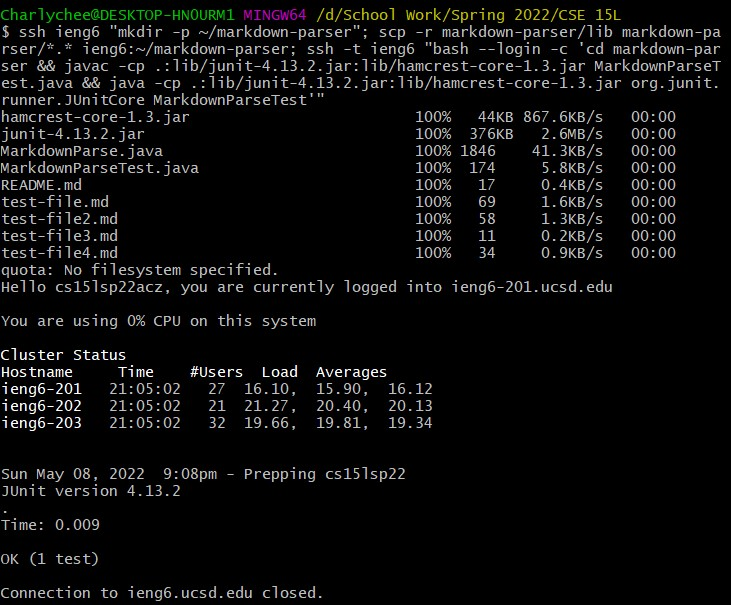

# Lab Report 3

## Streamlining SSH Configuration

Open the `.ssh/config` file

Add the SSH alias

Log into server using SSH alias

SCP Files using SSH alias

Check SCP'd file on server

## Setup Github Access from ieng6

Public Key on GitHub

Public Key and Private Key on ieng6

Running Git commands

[Link to Commit](https://github.com/Charlychee/cse15l-lab-reports/commit/8e04400d275072713fcff4b9a3f39013162c81e5)

## Copy whole directories with `scp -r`

Copying directory to server

Login and Compile and Run tests

Copy the whole directory and run the tests in one line.

`ssh ieng6 "mkdir -p ~/markdown-parser"; scp -r markdown-parser/lib markdown-parser/*.* ieng6:~/markdown-parser; ssh -t ieng6 "bash --login -c 'cd markdown-parser && javac -cp .:lib/junit-4.13.2.jar:lib/hamcrest-core-1.3.jar MarkdownParseTest.java && java -cp .:lib/junit-4.13.2.jar:lib/hamcrest-core-1.3.jar org.junit.runner.JUnitCore MarkdownParseTest'"`