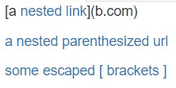
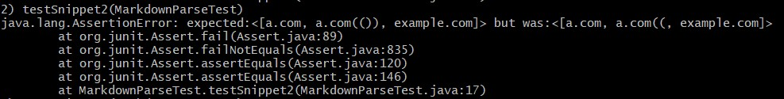

# Lab Report 4

## My Group Repo: https://github.com/333GUSSS/markdown-parser

## Reviewed Repo: https://github.com/charvishukla/markdown_parser_2

## Test Snippet 1
### Expectation

### Code Test

### My Result

### Reviewed Result

## Test Snippet 2
### Expectation

### Code Test

### My Result

### Reviewed Result

## Test Snippet 3
### Expectation

### Code Test

### My Result

### Reviewed Result)

## Reflection
### Snippet 1
Yes, there is a small code change that will make my program work for snippet 1 and all related cases that use inline code with backticks. I would add a search for backticks and skip any text between two backticks.
### Snippet 2
No, there would not be a small code change that will make my program work for snippet 2 and all related cases that nest parentheses, brackets, and escaped brackets. I handled nested parentheses by ignoring items within nested parentheses, however, it sames as though markdown does not follow that rule of nested parentheses handling. I would need to refactor my entire approach of nested handling.
### Snippet 3
Yes, there is a small code change that will make your program work for snippet 3 and all related cases that have newlines in brackets and parentheses. My code already handles all of the issues, however, it ran into an exception since it tried to index out of bounds. A few if statements would be necessary to avoid indexing out of bounds.

