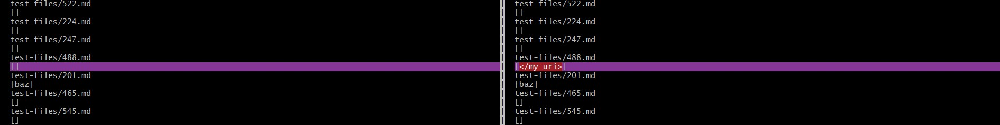
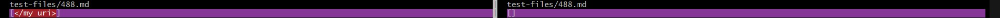
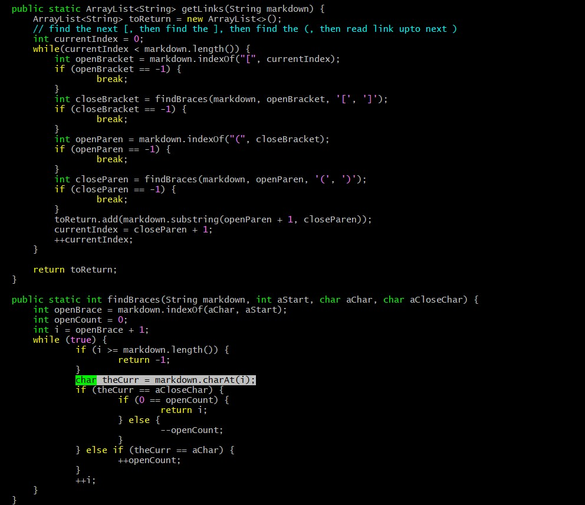
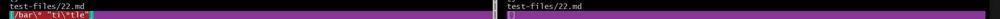

# Lab Report 5

## Finding the tests with different results

This was done through using the findLinks method in the MarkdownParser and passing in each link for every file. Then, I printed the file name and the links found. Then I had the output piped into a text file for both MarkdownParsers. Then I used vimdiff to compared side by side where the differences were, and looked at the file name that I printed above it.

## Link to test-file with different results

[Results](https://github.com/Charlychee/markdown-parser/blob/main/resultsJava.txt)

## Test One

The given implementation is correct.

*Note: My implementation is on the left*

The expected output is supposed to be `[]`.

The bug is that there is a space within the link. Spaces within links are invalid, so they would not render as a link in markdown. I would need to change the code to check for spaces when reading through each character, then not adding the substring to the return ArrayList if there is a space.

## Test Two

Neither implementation is correct

The expected output is supposed to be `bar*`.

The bug is that there is a space within the link, but there is a quote that succeeds it. In this case, it is a valid link, with an additional comment following the link. We would build off of the last test's fix and check that if there is a space, BUT there is a quote that follows it, then the link would be before the space, and the content that follows is irrelevant.

